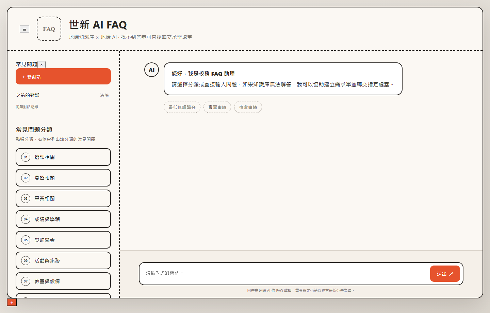
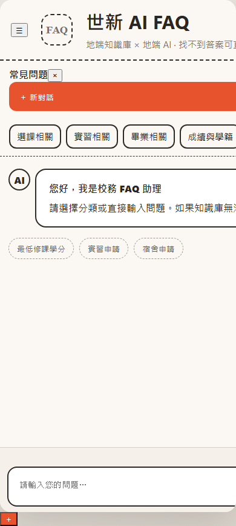
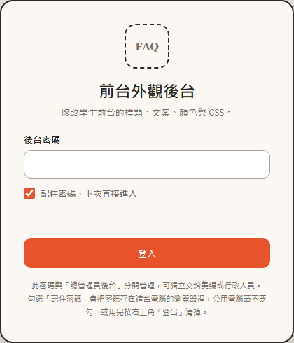
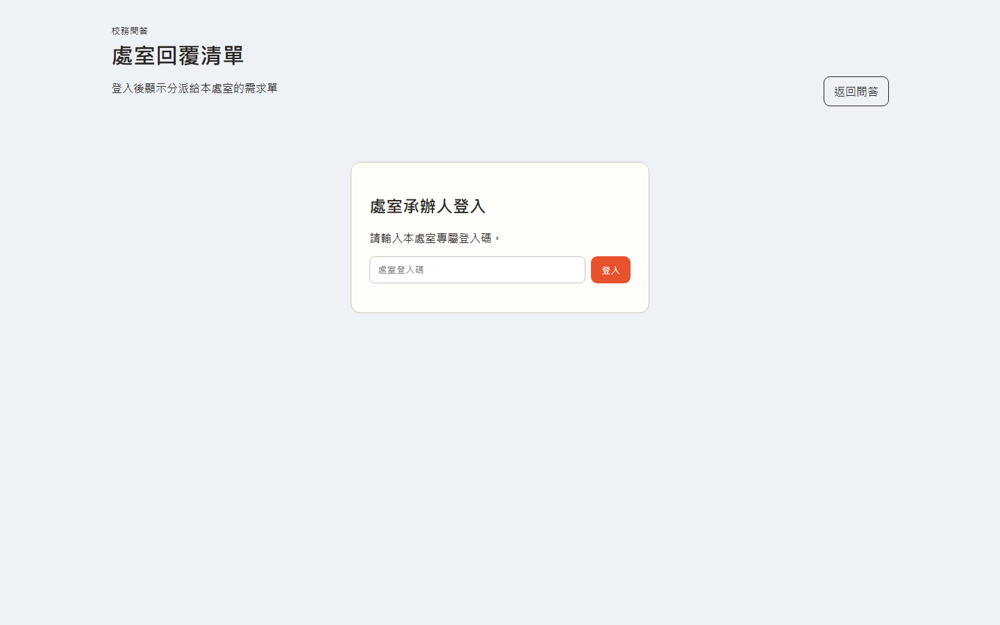
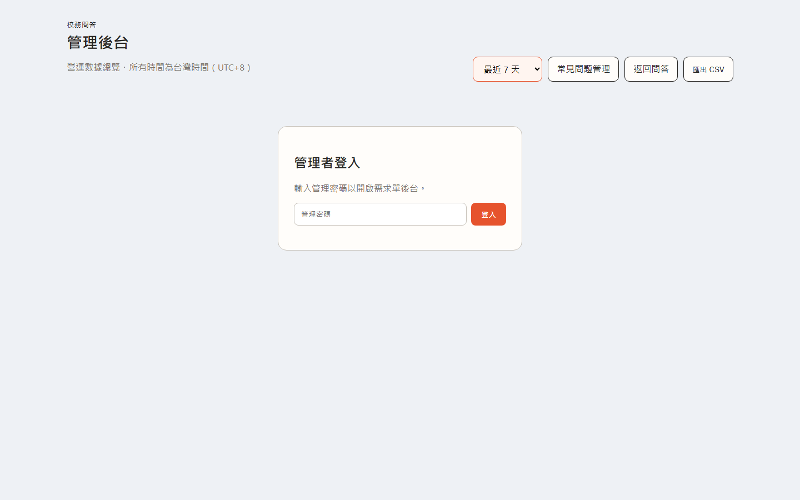
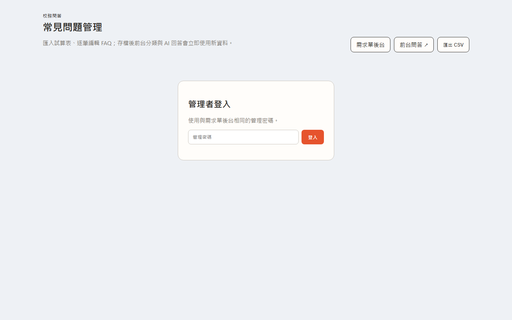
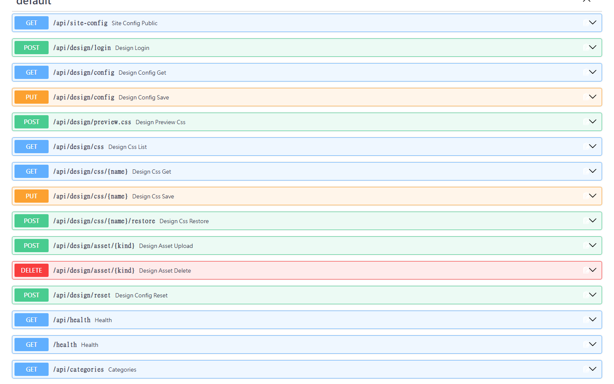

# 畫面與功能說明

逐項說明系統的每個畫面與後台功能。截圖拍攝於 2026-09-08，環境為校內網址
`https://ip-150-210.shu.edu.tw`。

> 需要登入才看得到的內頁（外觀後台各分頁、管理後台、處室清單）不放截圖，避免把
> 真實資料與密碼畫面收進版控。這些部分以文字、CSS 與 API 範例說明。

## 目錄

- [1. 學生前台](#1-學生前台)
- [2. 前台外觀後台 /design](#2-前台外觀後台-design)
- [3. 處室端 /office](#3-處室端-office)
- [4. 總管理員後台 /admin](#4-總管理員後台-admin)
- [5. 常見問題管理 /faq-admin](#5-常見問題管理-faq-admin)
- [6. 外觀相關 API](#6-外觀相關-api)

---

## 1. 學生前台

網址：`/`



| 區塊 | 說明 |
|---|---|
| 左上角方塊 | `.brand-mark`，預設是「FAQ」文字。可在外觀後台換成圖片 Logo |
| 標題 / 副標 | `data-sc="site_title"` / `site_subtitle`，文案在外觀後台改 |
| 側欄「＋ 新對話」 | 清空對話，回到歡迎訊息 |
| 側欄「之前的對話」 | 存在瀏覽器 localStorage，只有該台電腦看得到 |
| 側欄「常見問題分類」 | 預設讀知識庫分類；也可在外觀後台自訂清單與顯示名稱 |
| 對話區圓形頭像 | AI 側是 `.avatar`，學生側是 `.avatar.user-avatar`，兩邊都可換成圖片 |
| 歡迎訊息下方圓鈕 | 快捷問題，外觀後台可自訂「顯示文字」與「實際送出的問題」 |
| 輸入區 | 找不到答案時會出現「確認提出需求單」，轉由 AI 判斷送到對應處室 |

### 手機版



寬度 900px 以下改為單欄：側欄收合成上方橫向捲動的分類列，右下角出現「＋」浮動新對話鈕。

---

## 2. 前台外觀後台 `/design`

給美編或行政人員改前台外觀，密碼與總管理員後台分開管理。



登入框的「**記住密碼，下次直接進入**」預設勾選：

- 勾選 → 密碼存進瀏覽器 `localStorage`，關掉瀏覽器、重開電腦都還記得
- 不勾 → 只存 `sessionStorage`，關掉分頁就忘記
- 登入後右上角有「**登出**」，會把兩邊都清掉
- 存的密碼失效時會自動清除，並提示「記住的密碼已失效，請重新輸入」

> 公用電腦請不要勾。密碼是明文存在該台電腦的瀏覽器裡。

登入後左半邊是編輯區（六個分頁），右半邊是前台即時預覽，可切桌機 / 手機。
改完按右上角「**儲存並套用**」才會真正上線。

### 2.1 文案 / 標題

28 個文字欄位，分成「頁首與品牌」「側欄」「對話區」「需求單視窗」四組。
欄位留空會自動回到預設值。

前台是靠 `data-sc="<key>"` 對應，例如：

```html
<h1 data-sc="site_title">校務 FAQ 智慧問答</h1>
```

### 2.2 顏色與樣式

33 個樣式欄位。顏色欄位可點色塊挑，或直接輸入 `#RRGGBB`；數字欄位單位是 px。
上方有四組快速配色：原始暖橘、校園藍、沉穩綠、深色模式。

這些設定會組成 `/site-theme.css`，由後端即時產生，例如：

```css
:root{ --accent:#e6532d; --line:#2d2a27; ... }
.topbar{border-bottom-color:#2d2a27;}
.composer button{background:#e6532d;color:#ffffff;...}
```

### 2.3 Logo / 背景圖

可上傳四張圖片，**上傳後立刻套用，不需要再按「儲存並套用」**：

| 項目 | 取代的東西 |
|---|---|
| 網站 Logo | 左上角的「FAQ」方塊 |
| 頁面背景圖 | 整頁的漸層背景 |
| AI 對話頭像 | 對話框左邊圓形的「AI」 |
| 使用者對話頭像 | 對話框右邊圓形的「你」 |

限制：PNG / JPG / GIF / WEBP / SVG，單檔 3 MB 以內。檔案存到
`data/design-assets/`，以 `/media/<檔名>` 對外提供。按「移除圖片」會同時刪掉磁碟上的檔案。

下方四個欄位跟其他樣式一樣，要按「儲存並套用」：Logo 顯示大小、Logo 圓角、
背景圖顯示方式（填滿整頁 / 完整顯示 / 小圖平鋪）、背景圖遮罩濃度。

產生出來的 CSS 大致長這樣：

```css
.brand-mark{width:72px;height:72px;border-radius:16px;border-color:transparent;
  background:url('/media/logo-20260908103106.png') center/contain no-repeat;
  font-size:0;color:transparent;}
.avatar{width:43px;height:43px;}
.avatar:not(.user-avatar){background:url('/media/avatar-ai-....png') center/contain no-repeat;...}
.avatar.user-avatar{background:url('/media/avatar-user-....png') center/contain no-repeat;...}
```

前台的學生頭像同時帶著 `.avatar` 與 `.user-avatar` 兩個 class，所以用
`:not(.user-avatar)` 與 `.avatar.user-avatar` 把兩者拆開——只換其中一邊時，
另一邊不會被蓋掉。

### 2.4 分類與快捷

- **側欄分類**：「分類代碼」要對應知識庫裡的分類名稱，前台才列得出該分類的問題；
  「顯示名稱」是學生看到的文字。整份留空 = 用系統自動產生的分類。
  按「帶入目前知識庫分類」可一次匯入。
- **對話區快捷問題**：歡迎訊息下方的小圓鈕。「顯示文字」是按鈕上的字，
  「送出問題」是點下去實際問的內容。

### 2.5 自訂 CSS

寫在這裡的 CSS 會接在 `/site-theme.css` 最後面，可覆寫任何前台樣式。
安全處理：會移除 `@import` 與 `</style`，長度上限 20,000 字元。

### 2.6 原始 CSS 檔

可整份直接改的 CSS，白名單共 8 支：

| 檔名 | 用途 |
|---|---|
| `site-theme.css` | 「顏色與樣式」自動產生的主題檔 |
| `style.css` | 學生前台主樣式 |
| `llm.css` | AI 回答與對話紀錄樣式 |
| `ticket.css` | 需求單視窗 |
| `ticket-page.css` | 學生查看需求單頁 |
| `office.css` | 處室登入頁 |
| `office-ticket.css` | 處室需求單處理頁 |
| `admin.css` | 總管理員後台 |

`site-theme.css` 比較特別：它本來沒有實體檔案，是後端 `build_css()` 即時產生的。
在這裡存檔後，內容會寫進 `data/site-theme-override.css`，前台就改吃這份手寫版；
按「還原原始檔」會刪掉覆寫檔，回到自動產生。

> 一旦覆寫，「顏色與樣式」分頁的色票就不再生效——該分頁頂端會跳出紅色警示提醒。
> 只是想加東西的話，用「自訂 CSS」比較安全。

其餘 7 支是實體檔案。第一次修改前系統會自動把原始版本複製到
`data/css-original/`，之後隨時可以按「還原原始檔」救回來。存檔後會自動更新
HTML/JS 裡的 `?v=` 版本號，避免瀏覽器讀到舊快取。

---

## 3. 處室端 `/office`

所有處室共用同一個入口，各自輸入專屬密碼。



登入後看到自己處室的需求單清單，可回覆、結案。結案的內容可同步回知識庫。

---

## 4. 總管理員後台 `/admin`



未登入時只看得到營運數據總覽的外框，輸入管理密碼後才會載入需求單資料。
右上角可切換統計區間、跳到常見問題管理、匯出 CSV。

---

## 5. 常見問題管理 `/faq-admin`



與總管理員同一組密碼。可匯入 CSV、逐題編輯與刪除，存檔後會重新計算向量索引。

---

## 6. 外觀相關 API

`/docs` 有完整的 Swagger UI，不需登入即可查看介面定義（實際呼叫仍需密碼）。



| 方法 | 路徑 | 用途 |
|---|---|---|
| POST | `/api/design/login` | 驗證外觀後台密碼 |
| GET | `/api/design/config` | 取得目前設定、欄位定義、圖片欄位、是否已覆寫 CSS |
| PUT | `/api/design/config` | 儲存文案 / 樣式 / 分類 / 快捷 / 自訂 CSS |
| POST | `/api/design/preview.css` | 依傳入設定產生預覽用 CSS，不寫檔 |
| GET | `/api/design/css` | 列出可編輯的原始 CSS 檔 |
| GET | `/api/design/css/{name}` | 讀取單一 CSS 檔內容 |
| PUT | `/api/design/css/{name}` | 覆寫單一 CSS 檔 |
| POST | `/api/design/css/{name}/restore` | 還原成原始版本 |
| POST | `/api/design/asset/{kind}` | 上傳圖片，`kind` 為 `logo` / `page_bg` / `avatar_ai` / `avatar_user` |
| DELETE | `/api/design/asset/{kind}` | 移除圖片並刪除磁碟檔案 |
| POST | `/api/design/reset` | 全部還原預設 |

除 `login` 外，都需要帶 `X-Design-Token` 標頭。

```bash
# 讀設定
curl -H "X-Design-Token: <外觀後台密碼>" http://127.0.0.1:8001/api/design/config

# 上傳 Logo
curl -X POST -H "X-Design-Token: <外觀後台密碼>" \
     -F "file=@logo.png" http://127.0.0.1:8001/api/design/asset/logo
```

前台載入的 `/site-theme.css` 與 `/api/site-config` 是公開的，不需密碼。
